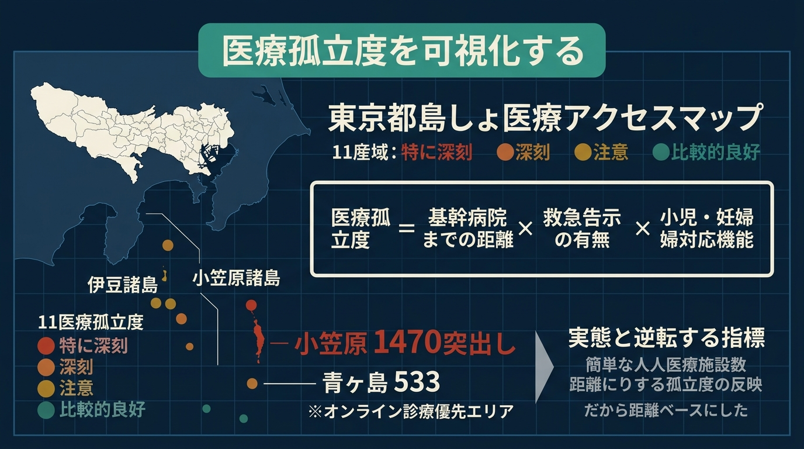
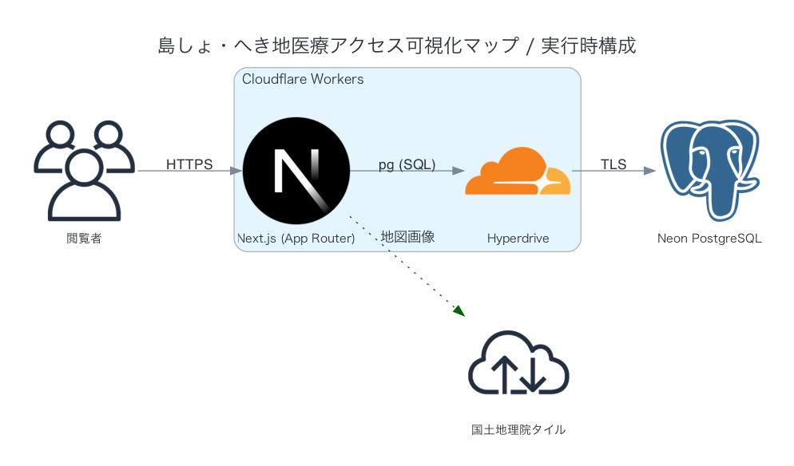
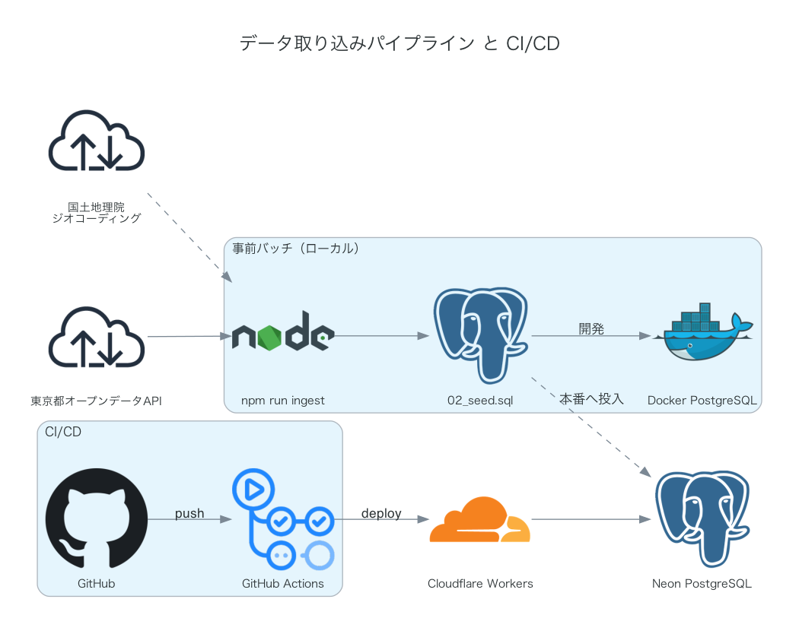

# 島しょ・へき地医療アクセス可視化マップ



東京都の島しょ部（伊豆諸島・小笠原諸島）と西多摩へき地の医療アクセス実態を可視化し、
オンライン診療の優先導入エリアを提案するマップ。

トップページ（`/`）が地図・ランキング・比較チャートをすべて含む1画面のワークブックになっている
（旧版はマップ/ダッシュボードが別ページの構成だったが、行き来せず1画面で完結するよう統合した）。

## 企画背景

東京都は伊豆諸島・小笠原諸島等の島しょ部を抱え、医療資源が本土と大きく異なる。
チームみらいの医療政策「オンライン診療/処方受け取り方法を充実し、通院のない受診を実現」のうち、
特に「島しょ部の僻地医療」を対象に、医療アクセスの実態を可視化し、オンライン診療導入の優先エリアを特定する狙い。
対象は島しょ9町村＋比較軸として西多摩へき地2町村（檜原村・奥多摩町）の計11エリア。

## 政策的位置づけ

- **都知事選公約**: 記載なし（都知事選公約との直接の対応は未確認）
- **チームみらい政策マニフェスト**: 医療政策「オンライン診療／処方受け取り方法を充実し、通院のない受診を実現」（[policy.team-mir.ai/policies/medical](https://policy.team-mir.ai/policies/medical)）のうち、島しょ部の僻地医療への言及部分

## できること

トップページ（`/`）内のタブで切り替える。ページ遷移せず、地図・一覧・詳細を行き来できる。

- **地図＋ランキング**（`/#map`）: 島しょ9町村＋西多摩へき地2町村を色分けバブルで表示（円の色=ギャップの深刻度、円の大きさ=人口）。右側のランキングやマップ上の島をクリックすると、その場に詳細パネル（医療機関一覧・本土への移動手段・距離定規）が開く。ズームすると医療機関ピン（救急=赤/診療所=青緑）を表示。小笠原は本土から約1,000km南のためジャンプボタンで移動
- **人口対比**（`/#compare`）: 人口と医療機関数の対比チャート
- **優先エリア提案**（`/#priority`）: ギャップスコアのランキングチャートと、オンライン診療導入優先エリアの提案テーブル（理由を自動生成）。エリア名クリックで地図タブの詳細パネルが開く
- **島別詳細**（`/island/[slug]`）: 上記の詳細パネルをフルページ化したもの。人口・世帯・面積・医療機関一覧・移動手段・距離・島内ミニマップを含み、共有用リンクとして使う

データはすべて東京都オープンデータAPI由来（11エリア・医療機関16か所・うち救急3）。

## アーキテクチャ

### 実行時構成



Cloudflare Workers 上の Next.js（App Router）が画面とAPI Routeの両方を担い、
DBアクセスは Hyperdrive 経由で Neon PostgreSQL に届く。
アプリから出る外部通信は地図タイル（国土地理院）と島名グリフだけで、APIキーは不要。

### データ取り込みと CI/CD



東京都オープンデータAPIへの通信は `npm run ingest` の事前バッチのみ。
生成された `db/init/02_seed.sql` をローカルDocker（開発）と Neon（本番）に投入する。
`main` への push で GitHub Actions が lint → 型チェック → ビルド → Workers デプロイを実行する。

## ギャップスコア（医療孤立度）の算出方法

```
gap_score = 基幹病院（都立広尾病院）までの直線距離km
            × 救急補正（救急告示医療機関なし: ×1.5）
            × 医療機能補正（小児対応なし: ×1.2、妊婦対応なし: ×1.2、医療機関ゼロ: ×2）
```

| スコア | レベル |
| :--- | :--- |
| 500以上 | 特に深刻（赤） |
| 250以上 | 深刻（オレンジ） |
| 150以上 | 注意（黄） |
| 150未満 | 比較的良好（緑） |

- 算出はDBの `area_gap` ビュー（`db/init/01_schema.sql`）に集約し、フロントはビューを読むだけ
- 補助指標として「一機関あたり人口 `pop_per_facility`」も算出
- 基幹病院は島しょ医療支援を担う都立広尾病院を採用
- 主指標を「人口÷医療機関数」ではなく**孤立度ベース（距離×救急補正×医療機能補正）**にしたのは、
  人口比だと人口最多の大島が1位・最も孤立した青ヶ島が最下位になり、政策優先度として実態と逆転するため

## 使用オープンデータ（東京都オープンデータAPI・動作確認済み）

| データ | 提供元 | API ID |
| :--- | :--- | :--- |
| 東京都の人口（推計） | 東京都総務局 | `t000003d2000001071-2f426fdbb32719c7530fa29ffee71129-0` |
| 救急医療機関一覧 | 東京都保健医療局 | `t000055d0000000356-ca6cc0d345b4afab5569dca8d7fb47e0-0` |
| 診療・検査医療機関の一覧 | 東京都保健医療局 | `t000055d0000000391-c5bbc28a5a7899eca7b4ec57c3ba03be-0` |

- 島しょ町村単体の医療機関一覧はオープンデータカタログに未登録のため、上記の全都データから対象自治体分を抽出している
- 「診療・検査医療機関の一覧」は発熱外来の届出情報由来のため、小児・妊婦・検査の対応状況は掲載時点のもの
- 本土への移動手段（船・飛行機・ヘリ等）はオープンデータに存在しないため、一般的な交通情報を島マスタとして静的定義

## データの取得タイミング

東京都オープンデータAPIへの通信は**事前の取り込み時のみ**で、アプリ実行中はローカルDBだけを参照する。

| タイミング | 通信先 | 内容 |
| :--- | :--- | :--- |
| 事前（`npm run ingest` 実行時） | 東京都オープンデータAPI | 人口・救急医療機関・診療検査医療機関を取得し `db/init/02_seed.sql` を生成 |
| 事前（同上） | 国土地理院ジオコーディングAPI | 医療機関の住所→緯度経度変換 |
| DB起動時（`docker compose up`） | なし | 生成済みSQLをPostgreSQLに自動投入 |
| アプリ実行中 | 国土地理院タイル・島名グリフのみ | 地図画像の表示。医療機関・人口はローカルDBから取得 |

## 既知の制約

- 医療機関の網羅性は「救急医療機関一覧」＋「診療・検査医療機関の一覧」の掲載範囲に依存する。正式な診療科目一覧（例: 資料第37 島しょ医療機関一覧）はPDFのみでAPI化されていないため、診療科目の代わりに医療機能フラグ（救急/小児/妊婦/検査）で表現している
- 基幹病院までの距離は直線距離であり、実際の搬送時間（船・ヘリの就航率など）は反映していない。交通手段カードの記載は参考情報
- 一部の医療機関は住所がジオコーディングできず、島の中心座標で表示している（`geocode_fallback` フラグ）
- 新島村は新島・式根島の2島を持つが、人口統計が村単位のため1エリアとして扱う
